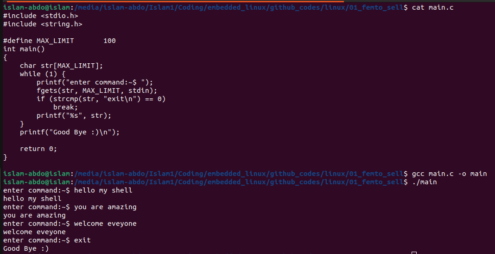

# Assignment #1 (Femto shell):
Write a femto shell program in c language that echoes any command entered by the user. 
The shell will have only one built-in command "exit". 
If the user entered "exit", the shell will reply with "Good Bye" and terminate.

# Solution 

