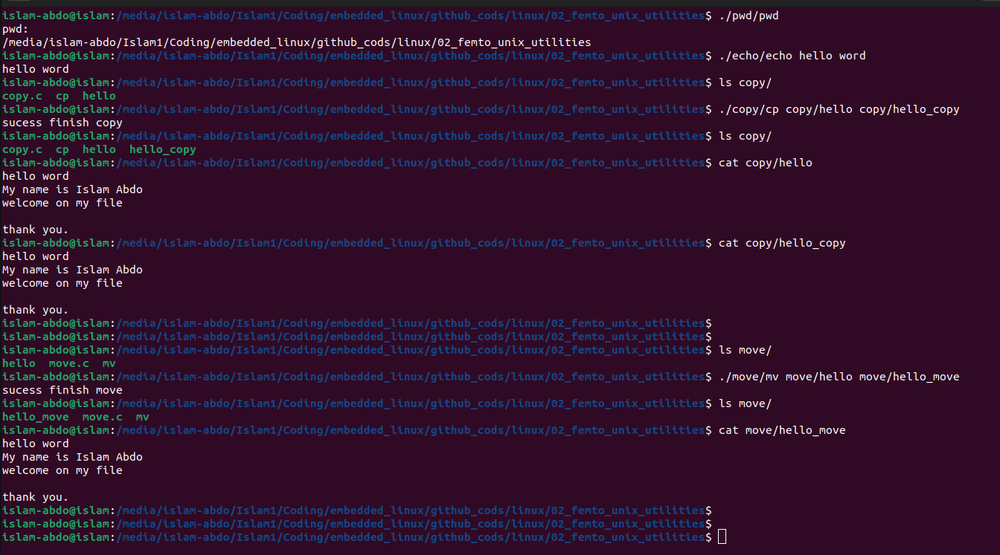
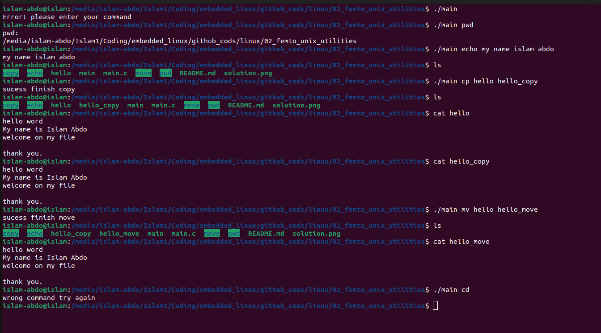

# Assignment #2 (Femto Unix Utilities (pwd, echo, cp, mv)) :
Write the following simple unix  utilities:
	1- pwd: print working directory (check man getcwd)
	2- echo: print a user input string on stdout (for example:  echo Hello World)
	3- cp: copy a file to another file and keep the original one (equivalent to copy/paste)
	4- mv: move a file to another file and remove the original one (equivalent to cut/paste) (check ).

# Solution 
## each utility is a separate program / separate c file.

## all utility in one file (main.c)

