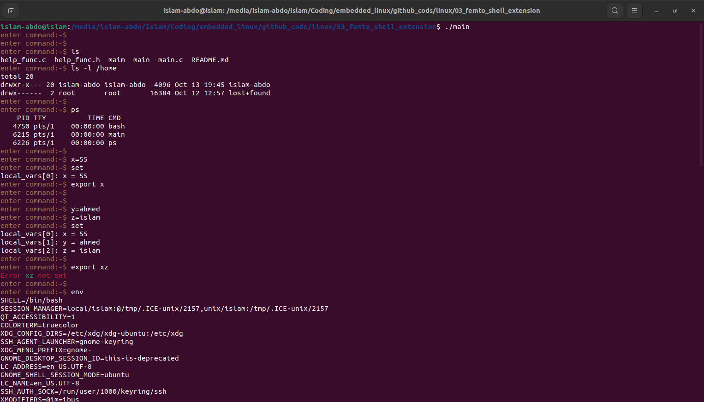
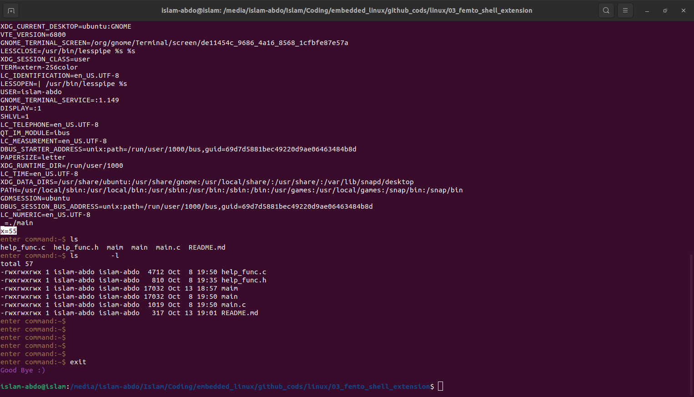

# Assignment #3 (Femto Shell Extension #1 )
Extend your femto shell to support the following features:

    1. Executing external commands using fork and exec
    2. Local and env variables where the env variables are passed to any child created by your shell while the local 
        variables are not passed to the children.

# Solution 

