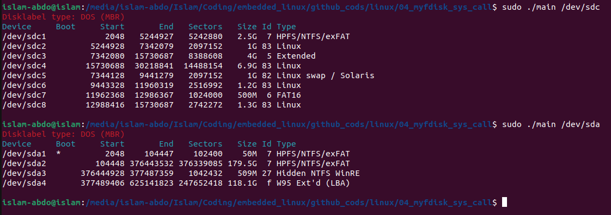
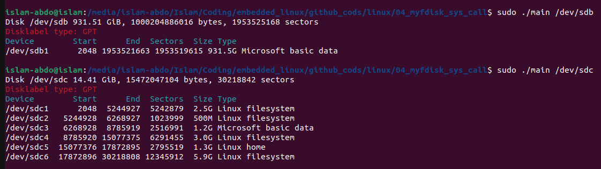

# Assignment #4 (Write a program similar to fdisk -l)

- In the session, we wrote a program that implements fdisk -l but reads only the partition table in the MBR and does not read the logical partitions.
- Extended the program to show the logical partitions if they exist.

Extra requirement for the super super runners
- Support parsing the GPT partition table 🙃
# Solution 
## MBR Partion table

## GPT Partion table

