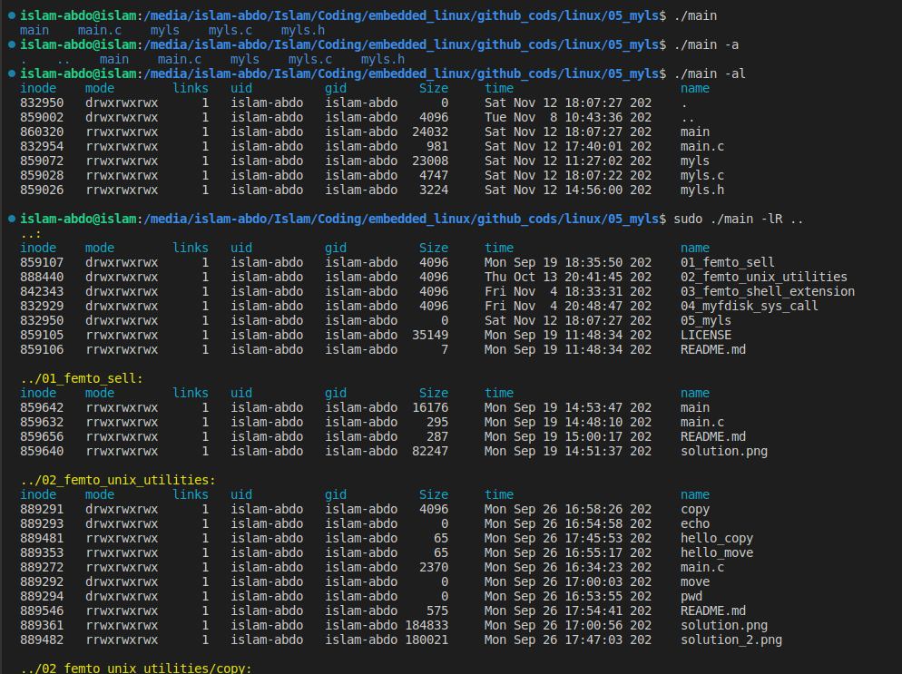
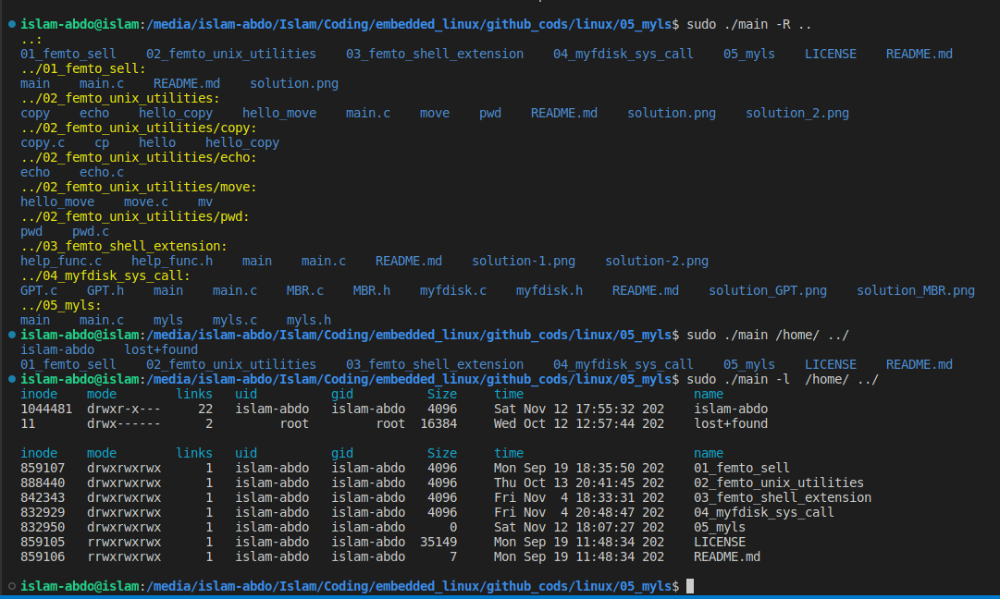
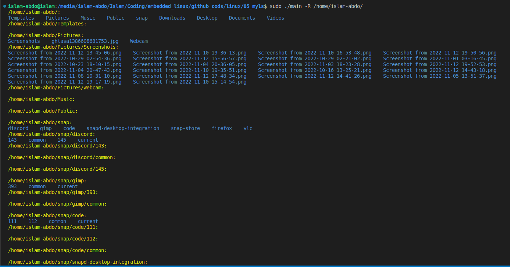

# Assignment #5 (Full-fledged Ls implementation):

Implement LS command that supports


- listing one or multiple directories
- Support long format (file type, permissions, num of links, user, group, time, ...)
- Show or hide hidden files
- can work recursively (similar to ls -R)
- Use ``` man 3 getopt ``` to support command line options (something like -l, -a, ... ) 
# Solution 






